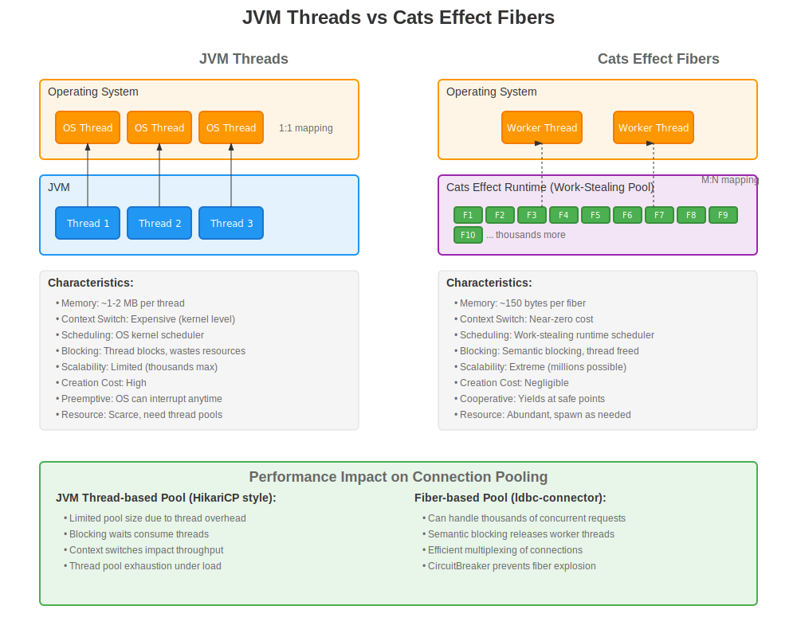



# コネクションプーリング

## 概要

ldbc-connectorは、高性能で安全なデータベースコネクションプーリングを提供する、Cats Effect向けに設計されたライブラリです。JVMの伝統的なスレッドベースのプーリング（HikariCPなど）とは異なり、Cats Effectのファイバーベースの並行性モデルを最大限に活用した設計となっています。

## アーキテクチャ概要


ldbc-connectorのプーリングシステムは、以下の主要コンポーネントで構成されています：

### 1. PooledDataSource

プールの中核となるコンポーネントで、コネクションのライフサイクル全体を管理します。

主な責任：
- コネクションの取得と返却の調整
- プールサイズの管理
- メトリクスの収集
- バックグラウンドタスクの調整

### 2. ConcurrentBag

HikariCPのConcurrentBagからインスピレーションを受けた、高性能な並行データ構造です。ただし、JVMのスレッドではなくCats Effectのファイバー向けに最適化されています。

特徴：
- ロックフリーな操作
- ファイバー間での直接ハンドオフ
- 待機キューの効率的な管理
- `Ref[F]`を使用した原子的な状態管理

### 3. CircuitBreaker

データベースがダウンしている場合の「雷鳴の群れ（Thundering Herd）」問題を防ぐための重要なコンポーネントです。

## CircuitBreakerの詳細

### 状態遷移図


### CircuitBreakerの目的

CircuitBreakerパターンは、以下の問題を解決するために実装されています：

1. **雷鳴の群れ（Thundering Herd）問題の防止**
   - データベースが一時的に利用できなくなった後、大量のクライアントが同時に再接続を試みる状況を防ぎます
   - これにより、既に問題を抱えているデータベースへの負荷をさらに増加させることを避けられます

2. **フェイルファスト**
   - データベースが応答しない場合、新しい接続試行を即座に失敗させます
   - これにより、クライアントは長いタイムアウトを待つ必要がなくなります

3. **段階的な回復**
   - Half-Open状態を通じて、サービスが回復したかどうかを慎重にテストします
   - 指数バックオフにより、繰り返し失敗する場合の再試行間隔を徐々に増やします

### 実装の詳細

```scala
trait CircuitBreaker[F[_]]:
  def protect[A](action: F[A]): F[A]
  def state: F[CircuitBreaker.State]
  def reset: F[Unit]
```

設定パラメータ：
- `maxFailures`: Open状態に移行するまでの失敗回数（デフォルト: 5）
- `resetTimeout`: Open状態から Half-Open状態への移行までの時間（デフォルト: 60秒）
- `exponentialBackoffFactor`: 失敗時のタイムアウト増加係数（デフォルト: 2.0）
- `maxResetTimeout`: 最大リセットタイムアウト（デフォルト: 5分）

### 動作フロー

1. **Closed（閉）状態**
   - すべてのリクエストが通常通り処理されます
   - 失敗がカウントされ、閾値に達するとOpen状態に移行します

2. **Open（開）状態**
   - すべてのリクエストが即座に失敗します（フェイルファスト）
   - リセットタイムアウト経過後、Half-Open状態への移行を試みます

3. **Half-Open（半開）状態**
   - 単一のテストリクエストを許可します
   - 成功した場合：Closed状態に戻ります
   - 失敗した場合：Open状態に戻り、タイムアウトを指数的に増加させます

## JVMスレッド vs Cats Effectファイバー

### 並行性モデルの違いと特性



#### JVMスレッドの特性（HikariCPなど）

**利点:**
- **OSレベルのサポート**: プリエンプティブなスケジューリング
- **既存エコシステム**: 多くのライブラリやツールが対応
- **デバッグツール**: 成熟したプロファイリング・監視ツール
- **シンプルな実行モデル**: 理解しやすい実行フロー

**制約:**
- **メモリ使用量**: スレッドあたり1-2MB
- **コンテキストスイッチ**: カーネルレベルで高コスト
- **スケーラビリティ**: 数千スレッドが実用的な上限
- **ブロッキング**: スレッドが実際にブロックされる

#### Cats Effectファイバーの特性（ldbc-connector）

**利点:**
- **メモリ効率**: ファイバーあたり約150バイト
- **軽量なコンテキストスイッチ**: ユーザー空間での切り替え
- **高スケーラビリティ**: 数百万のファイバーが可能
- **セマンティックブロッキング**: ワーカースレッドは解放される

**制約:**
- **協調的スケジューリング**: 明示的な yield ポイントが必要
- **学習曲線**: 関数型プログラミングの知識が必要
- **エコシステム**: 対応ライブラリが限定的
- **デバッグの複雑さ**: 非同期実行フローの追跡が困難

### プーリング設計への影響

それぞれの並行性モデルの特性により、プーリング実装は異なるアプローチを取ります：

#### スレッドベースプール（HikariCP型）
- **プールサイズ**: OSリソースの制約により慎重な設定が必要
- **待機戦略**: ブロッキング待機、専用スレッドプールの活用
- **適用場面**: CPU集約的なタスク、レガシーシステムとの統合
- **運用**: 既存の監視ツールでの管理が容易

#### ファイバーベースプール（ldbc-connector）
- **プールサイズ**: より大きなプールサイズが可能
- **待機戦略**: 非ブロッキング待機、効率的なリソース共有
- **適用場面**: I/O集約的なタスク、高並行性が必要な環境
- **運用**: Cats Effect対応の監視・管理が必要

## HikariCPとの比較

### 共通点

- 高性能を重視した設計
- ConcurrentBagのようなロックフリーなデータ構造
- プロキシパターンによるコネクション管理
- 自動的なプールサイズ調整

### 相違点

| 特徴             | HikariCP           | ldbc-connector   |
|----------------|--------------------|------------------|
| 並行性モデル         | JVMスレッド            | Cats Effectファイバー |
| ブロッキング処理       | スレッドをブロック          | セマンティックブロッキング    |
| スケーラビリティ       | スレッド数に制限           | ファイバー数はほぼ無制限     |
| CircuitBreaker | 外部ライブラリが必要         | 組み込み             |
| エラー処理          | 例外ベース              | 関数型              |
| リソース管理         | try-with-resources | Resource         |

### 使用シナリオと適用判断

#### ldbc-connectorが適している場面：

1. **高並行性環境**
   - 数千の同時接続リクエスト
   - マイクロサービスアーキテクチャ
   - リアクティブアプリケーション

2. **I/Oバウンドなワークロード**
   - 長時間実行されるクエリ
   - 複数のデータベースへの同時アクセス
   - 非同期処理パイプライン

3. **Cats Effectエコシステム**
   - 既にCats Effectを使用している
   - 関数型プログラミングのアプローチを採用
   - 型安全性を重視する環境

#### HikariCPなどスレッドベースプールが適している場面：

1. **既存システムとの統合**
   - レガシーアプリケーション
   - Spring Frameworkなどの従来型フレームワーク
   - JDBC準拠のツールとの互換性

2. **運用面の考慮**
   - 既存の監視・管理ツールの活用
   - 運用チームの既存知識の活用
   - 実績のある安定した実装

3. **シンプルな並行性要件**
   - 中程度の並行接続数
   - 予測可能なワークロード
   - CPU集約的な処理

## バックグラウンドタスク

ldbc-connectorは、プールの健全性を維持するために複数のバックグラウンドタスクを実行します：

### HouseKeeper
- 期限切れコネクションの削除
- アイドルタイムアウトの処理
- 最小コネクション数の維持

### AdaptivePoolSizer
- 使用率メトリクスに基づく動的なプールサイズ調整
- 負荷に応じた拡張と縮小
- クールダウン期間による安定化

### KeepaliveExecutor
- アイドルコネクションの定期的な検証
- 接続の維持とタイムアウトの防止

## 設定例

### 基本的な使用方法

```scala 3
import cats.effect.IO
import ldbc.connector.*
import scala.concurrent.duration.*

// プール設定
val config = MySQLConfig.default
  .setHost("localhost")
  .setPort(3306)
  .setUser("myuser")
  .setPassword("mypassword")
  .setDatabase("mydb")
  // プールサイズ設定
  .setMinConnections(5)           // 最小接続数（デフォルト: 5）
  .setMaxConnections(20)          // 最大接続数（デフォルト: 10）
  // タイムアウト設定
  .setConnectionTimeout(30.seconds)    // 接続取得タイムアウト（デフォルト: 30秒）
  .setIdleTimeout(10.minutes)         // アイドルタイムアウト（デフォルト: 10分）
  .setMaxLifetime(30.minutes)         // 最大生存時間（デフォルト: 30分）
  .setValidationTimeout(5.seconds)    // 検証タイムアウト（デフォルト: 5秒）
  // 検証とヘルスチェック
  .setAliveBypassWindow(500.millis)   // 最近使用時の検証スキップ（デフォルト: 500ms）
  .setKeepaliveTime(2.minutes)        // アイドル検証間隔（デフォルト: 2分）
  .setConnectionTestQuery("SELECT 1") // カスタムテストクエリ（オプション）
  // リーク検出
  .setLeakDetectionThreshold(2.minutes) // 接続リーク検出（デフォルト: なし）
  // メンテナンス
  .setMaintenanceInterval(30.seconds)  // バックグラウンドクリーンアップ間隔（デフォルト: 30秒）
  // アダプティブサイジング
  .setAdaptiveSizing(true)            // 動的プールサイズ調整（デフォルト: false）
  .setAdaptiveInterval(1.minute)      // アダプティブサイジング確認間隔（デフォルト: 1分）

// プールデータソースの作成
val poolResource = MySQLDataSource.pooling[IO](config)

// プールの使用
poolResource.use { pool =>
  pool.getConnection.use { conn =>
    // コネクションの使用
    for
      stmt <- conn.createStatement()
      rs   <- stmt.executeQuery("SELECT 1")
      _    <- rs.next()
      result <- rs.getInt(1)
    yield result
  }
}
```

### メトリクス追跡付きプール

```scala 3
import ldbc.connector.pool.*

val metricsResource = for
  tracker <- Resource.eval(PoolMetricsTracker.inMemory[IO])
  pool    <- MySQLDataSource.pooling[IO](
    config,
    metricsTracker = Some(tracker)
  )
yield (pool, tracker)

metricsResource.use { case (pool, tracker) =>
  // プールの使用とメトリクス監視
  for
    _       <- pool.getConnection.use(conn => /* コネクション使用 */ IO.unit)
    metrics <- tracker.getMetrics
    _       <- IO.println(s"総取得数: ${metrics.totalAcquisitions}")
    _       <- IO.println(s"平均取得時間: ${metrics.acquisitionTime}")
  yield ()
}
```

### ライフサイクルフック付きプール

```scala 3
case class SessionContext(userId: String, startTime: Long)

val beforeHook: Connection[IO] => IO[SessionContext] = conn =>
  for
    _ <- conn.createStatement().flatMap(_.executeUpdate("SET SESSION sql_mode = 'STRICT_ALL_TABLES'"))
    startTime = System.currentTimeMillis
  yield SessionContext("user123", startTime)

val afterHook: (SessionContext, Connection[IO]) => IO[Unit] = (ctx, conn) =>
  IO.println(s"ユーザー ${ctx.userId} が接続を ${System.currentTimeMillis - ctx.startTime}ms 使用")

val poolWithHooks = MySQLDataSource.poolingWithBeforeAfter[IO, SessionContext](
  config = config,
  before = Some(beforeHook),
  after = Some(afterHook)
)
```

### CircuitBreakerの設定

CircuitBreakerは内部で自動的に設定されますが、現在の実装では以下のデフォルト値が使用されます：

- `maxFailures`: 5回（Open状態への移行閾値）
- `resetTimeout`: 30秒（Half-Open状態への移行時間）
- `exponentialBackoffFactor`: 2.0（バックオフ係数）
- `maxResetTimeout`: 5分（最大リセットタイムアウト）

## まとめ

ldbc-connectorのプーリングシステムは、Cats Effectの並行性モデルを活用した実装です。CircuitBreakerパターンを組み込むことで、データベース障害時の回復力を高めています。

ファイバーベースとスレッドベースのアプローチには、それぞれ長所と短所があります。アプリケーションの要件、既存のインフラストラクチャ、チームのスキルセット、運用面の考慮事項などを総合的に評価して、適切な選択をすることが重要です。

ldbc-connectorは、特に高並行性が求められる環境や、Cats Effectエコシステムを採用している場合に、その特性を最大限に活用できる選択肢となります。
