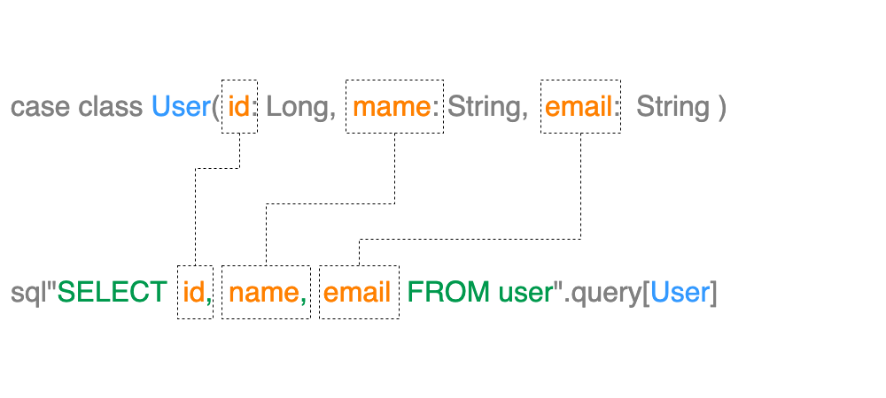



# データ選択

この章では、ldbcデータセットを使用してデータを選択する方法を説明します。

## コレクションへの行の読み込み

最初のクエリでは、低レベルのクエリを目指して、いくつかのユーザーをリストに選択し、最初の数件をプリントアウトしてみましょう。ここにはいくつかのステップがあるので、途中のタイプを記しておきます。

```scala
sql"SELECT name FROM user"
  .query[String] // Query[IO, String]
  .to[List] // Executor[IO, List[String]]
  .readOnly(conn) // IO[List[String]]
  .unsafeRunSync() // List[String]
  .foreach(println) // Unit
```

これを少し分解してみよう。

- `sql"SELECT name FROM user".query[String]`は`Query[IO, String]`を定義し、返される各行をStringにマップする1列のクエリです。このクエリは1列のクエリで、返される行をそれぞれStringにマップします。
- `.to[List]`は、行をリストに蓄積する便利なメソッドで、この場合は`Executor[IO, List[String]]`を生成します。このメソッドは、CanBuildFromを持つすべてのコレクション・タイプで動作します。
- `readOnly(conn)`は`IO[List[String]]`を生成し、これを実行すると通常のScala `List[String]`が出力される。
- `unsafeRunSync()`は、IOモナドを実行し、結果を取得する。これは、IOモナドを実行し、結果を取得するために使用される。
- `foreach(println)`は、リストの各要素をプリントアウトする。

## 複数列クエリ

もちろん、複数のカラムを選択してタプルにマッピングすることもできます。

```scala
sql"SELECT name, email FROM user"
  .query[(String, String)] // Query[IO, (String, String)]
  .to[List] // Executor[IO, List[(String, String)]]
  .readOnly(conn) // IO[List[(String, String)]]
  .unsafeRunSync() // List[(String, String)]
  .foreach(println) // Unit
```

## クラスへのマッピング

ldbcは、複数のカラムを選択してクラスにマッピングすることもできます。これは、`User`クラスを定義して、クエリの結果を`User`クラスにマッピングする例です。

```scala 3
case class User(id: Long, name: String, email: String)

sql"SELECT id, name, email FROM user"
  .query[User] // Query[IO, User]
  .to[List] // Executor[IO, List[User]]
  .readOnly(conn) // IO[List[User]]
  .unsafeRunSync() // List[User]
  .foreach(println) // Unit
```

クラスのフィールドは、クエリのカラム名と一致する必要があります。これは、`User`クラスのフィールドが`id`、`name`、`email`であるため、クエリのカラム名が`id`、`name`、`email`であることを意味します。



`Join`などを使用して複数のテーブルからデータを選択する方法を見てみましょう。

これは、`City`, `Country`, `CityWithCountry`クラスそれぞれを定義して、`city`と`country`テーブルを`Join`したクエリの結果を`CityWithCountry`クラスにマッピングする例です。

```scala 3
case class City(id: Long, name: String)
case class Country(code: String, name: String, region: String)
case class CityWithCountry(coty: City, country: Country)

sql"""
  SELECT
    city.id,
    city.name,
    country.code,
    country.name,
    country.region
  FROM city
  JOIN country ON city.country_code = country.code
"""
  .query[CityWithCountry] // Query[IO, CityWithCountry]
  .to[List] // Executor[IO, List[CityWithCountry]]
  .readOnly(conn) // IO[List[CityWithCountry]]
  .unsafeRunSync() // List[CityWithCountry]
  .foreach(println) // Unit
```

クラスのフィールドは、クエリのカラム名と一致する必要があると先ほど述べました。
この場合、`City`クラスのフィールドが`id`、`name`であり、`Country`クラスのフィールドが`code`、`name`、`region`であるため、クエリのカラム名が`id`、`name`、`code`、`name`、`region`であることを意味します。

`Join`を行った場合、それぞれのカラムはテーブル名と共に指定しどのテーブルのカラムかを明示する必要があります。 
この例では、`city.id`、`city.name`、`country.code`、`country.name`、`country.region`として指定しています。

ldbcではこのように`テーブル名`.`カラム名`を`クラス名`.`フィールド名`にマッピングすることによって、複数のテーブルから取得したデータをネストしたクラスにマッピングすることができます。


ldbcでは`Join`を行い複数のテーブルからデータを取得する際に、単体のクラスのみではなくクラスの`Tuple`にマッピングすることもできます。

```scala 3
case class City(id: Long, name: String)
case class Country(code: String, countryName: String, region: String)

sql"""
  SELECT
    city.id,
    city.name,
    country.code,
    country.name AS countryName,
    country.region
  FROM city
  JOIN country ON city.country_code = country.code
"""
  .query[(City, Country)] // Query[IO, (City, Country)]
  .to[List] // Executor[IO, List[(City, Country)]]
  .readOnly(conn) // IO[List[(City, Country)]]
  .unsafeRunSync() // List[(City, Country)]
  .foreach(println) // Unit
```

この例では、`City`クラスと`Country`クラスを`Tuple`にマッピングしています。

ここで注意したいのが、先ほどと異なり`テーブル名`.`カラム名`を`クラス名`.`フィールド名`にマッピングすることはできません。なぜならクラスのフィールドにはテーブル名が含まれていないためです。

今回の`city`と`country`テーブルのように`name`という同じ名前のカラムが存在する場合、どちらのカラムをどのクラスのフィールドにマッピングするかを判別することができません。

そのため、`Country`クラスの`name`カラムを`countryName`としデータを`SELECT`文で指定する際に同様に`country`テーブルの`name`カラムを`countryName`というエイリアスを指定することでマッピングできるようにしています。
